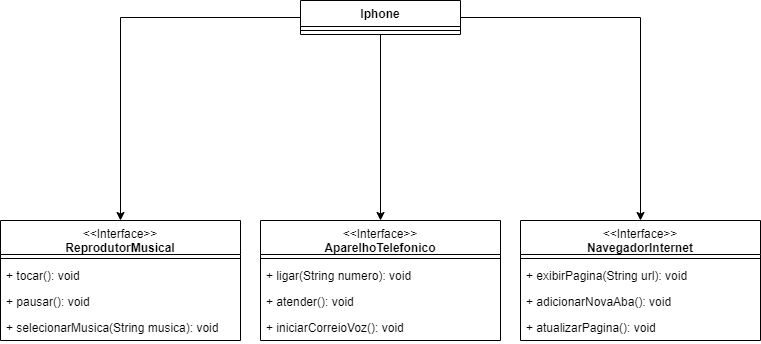

# Recriando a Interface de um Iphone

Este repositório se destina a consolidar meus conhecimentos relacionados aos conceitos de Programa Orientada a Objetos utilizando JAVA e aos conceitos de ULM e diagramas.

## Diagrama do Iphone
